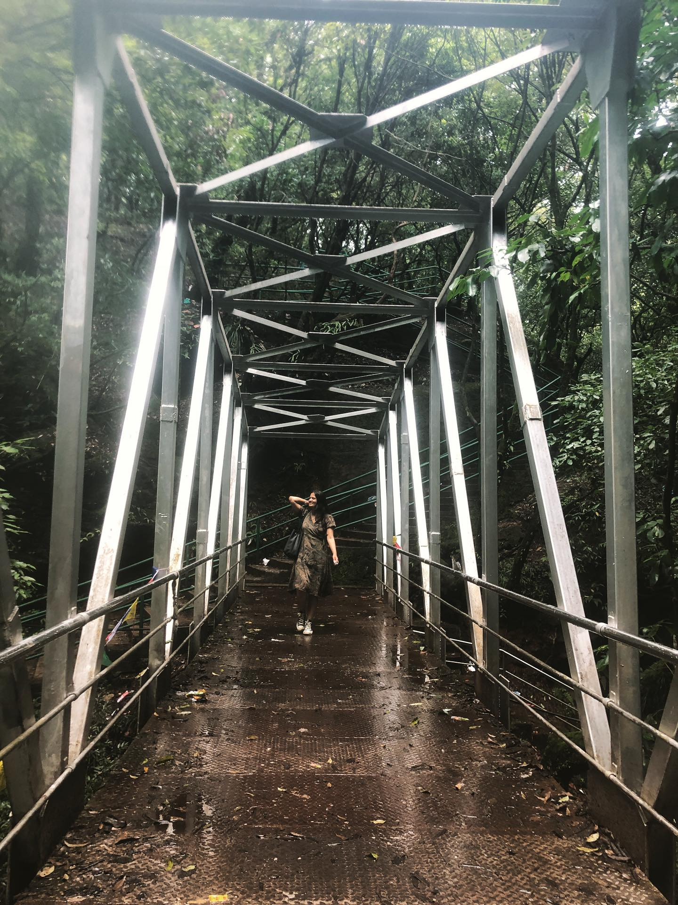
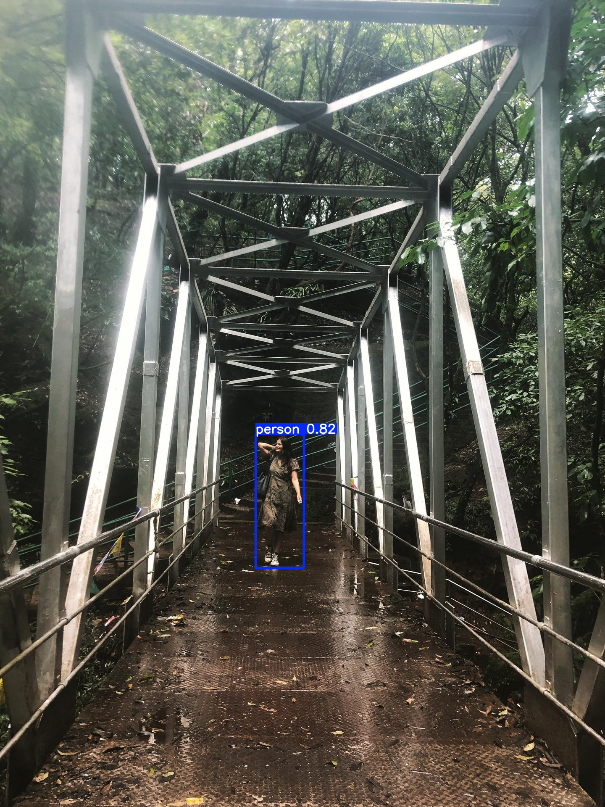

# YOLOv5 Video Object Detection

A real-time video object detection project using **YOLOv5**, implemented in Python with **PyTorch** and **OpenCV**. This project detects and tracks objects in videos, showing bounding boxes, class labels, and confidence scores.

---

## 🚀 Features

- Real-time object detection on uploaded videos.
- Uses pretrained YOLOv5 models (`yolov5s.pt`) for fast and accurate inference.
- Supports uploading videos from local storage or Google Drive.
- Configurable detection confidence and image size.
- Saves processed videos and optional cropped detections.
- Works on Google Colab with GPU acceleration.

---

## 🛠 Tech Stack

- Python 3.12  
- PyTorch  
- OpenCV  
- YOLOv5  
- Google Colab (optional)

---

## 📁 Input & Output

- **Input Video:** Any `.mp4` or `.avi` video uploaded by the user. Example: `your_video.mp4`.  
- **Output Video:** Annotated video with bounding boxes and class labels, saved in `runs/detect/exp/`.  
- **Optional Outputs:**  
  - Cropped detected objects (`--save-crop`)  
  - Detection coordinates in `.txt` (`--save-txt`)  

## 🔗 Project Files

### Input → Output

- **Input Video:** [View/Download](https://drive.google.com/file/d/1f7yg-yfKDP5lIMl21Yu-SU2ummSM-K_d/view?usp=sharingz)  
- **Output Video:** [View/Download](https://drive.google.com/file/d/1tUAhEZc5lLqnIrPD532UmvRD8Sgeq_kP/view?usp=sharing)  

> Click the links above to see the detection result from input to output.

---

### Example Image

You can also provide an image as input to show YOLOv5 detection:

 | 
 |
 v
 

